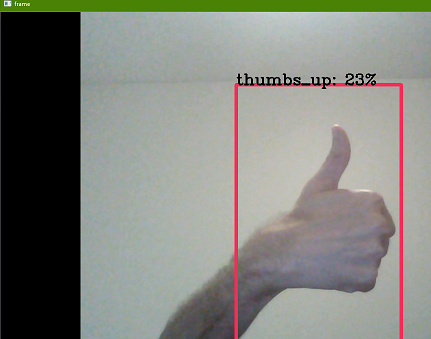
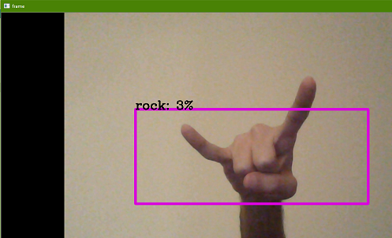
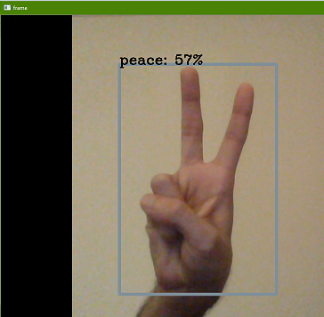
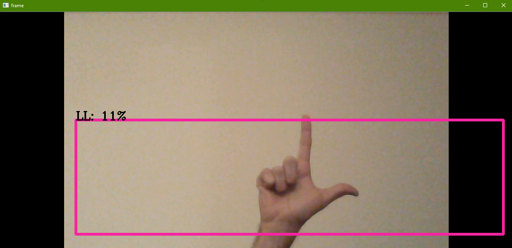

### The YOLO music application is a real-time music production program through which users would be able to explore music and make compositions just by the use of hand gestures. My idea was to connect this to AI technology and use gesture based interface to go beyond the tile based interface so that users can find this application more interesting.

Software implementation or program
-----------
The specific technology used from the YOLO model for the training process was “YOLOv2-tiny” which as the name suggests is the second version. The additional tiny version adds to the frames per second compared to the regular version. But the accuracy decreases with higher fps.
For capturing video in real-time, reading the frames and annotation, Opencv2 library was used extensively throughout the project.

Custom object detection training process
-----------
1. Producing dataset - Recorded each gesture as a video file of ~1 minute each and divided one gesture video to 400 images.
2. Annotating the images - Used draw_box.py program to label gestures to produce .xml files with gesture in YOLO format coordinates inside the .xml file
3. Manipulating the configuration(cfg) files - changed the number of classes in the region layer to the number of gestures , that is, 4 . 4. Changed the filters variable according to the formula - 5*(5+ classes) inside the convolutional layer.
5. Getting the equivalent .weights file for the cfg file - Installed the yolov2-tiny.weights file for the cfg file
6. Listing objects in labels.txt file - All the object(gesture) names were written down in the labels.txt file each in a new line.
7. Using the training command to train the model - This is where the training begins after the command is entered. The following command was - 
python flow --model cfg/yolov2-tiny-voc-1c.cfg --load bin/yolov2-tiny-voc.weights --train --annotation Annotations --dataset obj --gpu 1.0 --epoch 1000

Since the dataset for each gesture was small(400 images), I used a higher epoch value of 1000.

Due to GitHub's size limit, the checkpoint weights and the original weights that were above 100 MB couldn't be uploaded.

Once the training was done, it was time to code the melodies in Sonic Pi.

Sonic Pi implementation
-------------
Essentially, every gesture label is binded to a music function which is executed in Sonic pi. These functions were coded using python-sonic(psonic) library. Once the Sonic pi function is called, it runs on the Sonic Pi environment on the local machine in the background.

Initially, the whole program was running as a single thread. This made the object detection model lag when the music functions were called.
Solution: Used multithreading to make all the functions run simultaneously once they were called.

Ex. Opencv video capture - drum track - guitar melody
